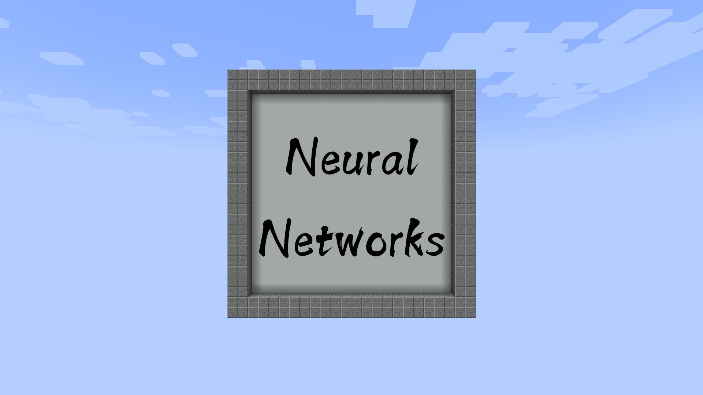

# Minecraft Neural Networks

> **AVAILABLE ON 1.21.9**
>
> **Click [here](https://github.com/AjjMC/Minecraft-Neural-Networks/archive/refs/heads/main.zip) to download.**
>
> **For any queries, please use the issues section.**

> **RECOGNIZED BY MOJANG**
>
> **Featured on the official Minecraft Realms as part of the ["Survival: The Remix" release](https://www.minecraft.net/en-us/article/new-on-java-realms-survival-the-remix) (April 2025)!**

  

## Overview

Neural Networks is a map with interactive AI systems for reading handwritten digits and letters drawn on a canvas. This is achieved using AI models trained IRL on image classification, which were engineered for use in the game.

## Demo

- The hotbar contains tools for interacting with the canvas.
- Outputs are shown as characters are being drawn.
- There are three AI models available in the settings.

## Acknowledgement

- [ajjnn datapack](https://github.com/AjjMC/ajjnn)
- [EMNIST dataset](https://www.nist.gov/itl/products-and-services/emnist-dataset)
